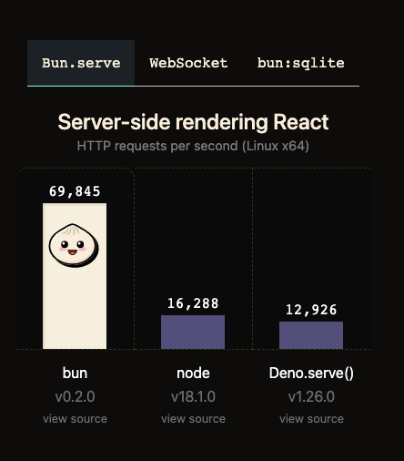

I first became interested in the contention between "kernel space" and "user space" after reading a tweet from Nikita Bier:

<blockquote class="twitter-tweet">
Imagine you&#39;re the founder of a developer tool startup with 100 engineers and $20 million raised. And a single dude in an apartment—with 34,000 Github stars and burning only $2k/mo—is eating your lunch. <a href="https://t.co/sOJ4itOkl7">https://t.co/sOJ4itOkl7</a>
&mdash; Nikita Bier (@nikitabier) <a href="https://twitter.com/nikitabier/status/1570272332492722176?ref_src=twsrc%5Etfw">September 15, 2022</a></blockquote> 

I'm not certain the 100 engineer/$20 million raised startup Nikita refers to, but
I do know that Nikita is praising [Jarred Sumner](https://twitter.com/jarredsumner)
for his thrifty leadership running Bun, a blazing fast JavaScript runtime.

How could you not lavish praise with benchmark comparisons like this?:

I'm going to cut to the chase on this: the speedup that bun sees has _very_ little to do with using a niche language like Zig, but more to the fact that `Bun` is using and optimizing for the `sendfile` syscall, whereas `node`/`deno` use the `send` syscall for more transportable binaries.

[`send`](https://man7.org/linux/man-pages/man2/send.2.html) is a POSIX interface that most operating systems implement with or without extensions. [`sendfile`]() on the other hand 
isn't supported in some mainstream kernels like OpenBSD/NetBSD, but can be found Linux, Mac, and Windows according to [_Can I Use a System Call_](https://justine.lol/cosmopolitan/functions.html).

